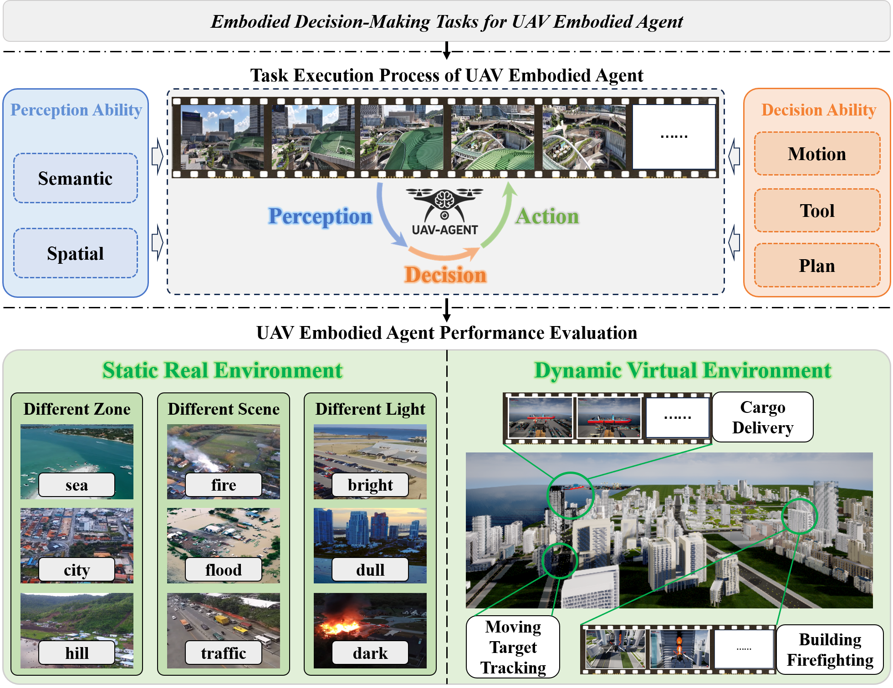

# BEDI: A Comprehensive Benchmark for Evaluating Embodied Agents on UAVs
This project introduces **BEDI (Benchmark for Embodied Drone Intelligence)**, a comprehensive and standardized evaluation framework for UAV-Embodied Agents (UAV-EAs) in autonomous tasks. BEDI leverages the dynamic capabilities of Vision-Language Models (VLMs) and incorporates a novel Dynamic Chain-of-Embodied-Task paradigm, which decomposes complex UAV tasks into standardized, measurable subtasks based on the perception-decision-action loop. The benchmark evaluates UAV-EAs across five core sub-skills: semantic perception, spatial perception, motion control, tool utilization, and task planning. Additionally, BEDI integrates static real-world environments with dynamic virtual scenarios, offering a hybrid testing platform that allows for flexible task customization and scenario extension. By providing open, standardized interfaces and conducting empirical evaluations, BEDI identifies limitations in current UAV-EA models and paves the way for future advancements in embodied intelligence research and model optimization.

  

## The Composition of the Testing Environment for BEDI
We have collected real UAV imagery to construct a representative real-world test dataset for static testing, while also creating a dynamic virtual testing environment using Unreal Engine (UE) and AirSim to support interaction with UAV-EAs. To facilitate evaluation, BEDI includes task-specific evaluation metrics and interaction interfaces. The platform consists of three core components:

* Test environments (static real-world and dynamic virtual)
* Open interaction interfaces
* Evaluation metrics (for both static and dynamic tasks)

## Release Notes
- **[2025/07/01] 🔥 Release of the Static Image Test Dataset 1.0** The dataset covers two types of perception questions (Semantic Perception, Spatial Perception) and three types of decision-making questions (Motion Control, Tool Utilization, Task Planning). The specific sample composition included in the dataset is as follows:

  * 154 images for perception evaluation, 2,740 total perception-related questions
    * 1,020 semantic discrimination questions
    * 422 semantic description questions
    * 582 semantic target determination questions
    * 455 spatial direction questions
    * 261 spatial distance questions
  * 30 images for decision-making evaluation, 357 total decision-related questions
    * 140 motion control questions
    * 114 tool utilization questions
    * 103 task planning questions
  
  The dataset can be obtained from the following link: (https://huggingface.co/datasets/GuoMN/BEDI). At the same time, the evaluation code for the static image experiment results has also been uploaded in the `test` folder.

