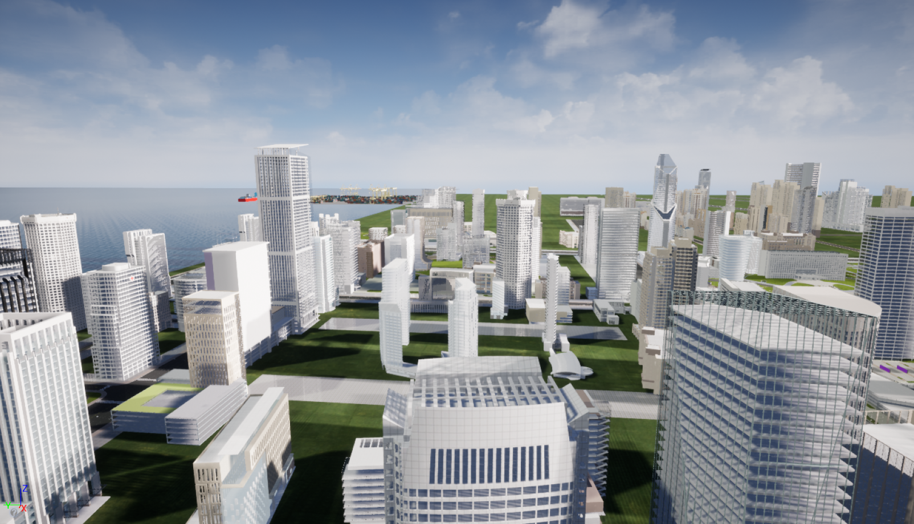

# **BEDI: A Comprehensive Benchmark for Evaluating Embodied Agents on UAVs**  
*— A Comprehensive Benchmark for Autonomous Drone Capabilities in Dynamic Environments*

---

## 🌍 Dynamic Virtual Environment  
As a core component of the **BEDI benchmark**, we provide a highly realistic dynamic virtual environment built using **Unreal Engine (UE)**. This environment is designed to evaluate drones' autonomous perception, decision-making, and control capabilities under complex and real-world conditions.

### 🏞️ Featured Scenarios
The current environment includes three meticulously crafted scenarios that cater to diverse drone intelligence tasks:

1. **Cargo Port** — Simulates a busy port operation setting, ideal for testing navigation and landing capabilities in complex logistics environments.  
2. **Building on Fire** — Constructs an emergency disaster scenario, suitable for studying drone perception and response in rescue missions.  
3. **Urban Cityscape** — Mimics dense urban spaces, useful for assessing obstacle avoidance and path planning in intricate 3D environments.

Additionally, the environment integrates the [**AirSim**](https://github.com/microsoft/AirSim) plugin, enabling the introduction of externally controllable drone models for flexible algorithm integration and real-time control.

---
### 🧩 Example Task  
Based on these scenarios, users can design a variety of embodied intelligent tasks, such as:  
> *“Control the drone to land on a cargo ship docked within the port.”*

This provides a  foundation for testing the generalization ability and task completion efficiency of drones in realistic environments.

---

### 🖼️ Example Environment Visualization

  

